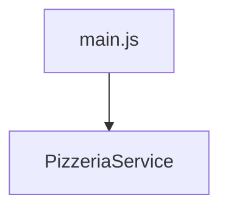
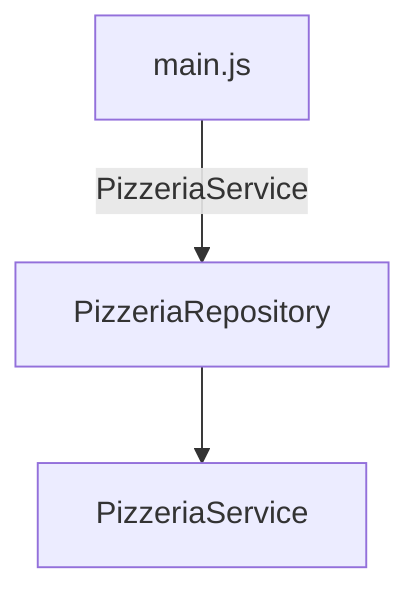

# Sprint 5. Aplicació de patrons de disseny i transformacions XSLT

## Creació d'un repositori i injecció de dependències

El primer que hem afegit en aquest Sprint ha estat l'aplicació d'un patró arquitectònic Repository. Aquest patró actua com a pont entre la lògica de negoci (coneguda com domini) i l’accés a les dades, que és el que realitzavem a la classe Service.

És a dir, passem de:



Al següent:



El codi d'aquesta nova classe Repository segueix un patró Singleton, amb les peculiaritats de Javascript (que com sabem és no tipat i no permet definir propietats privades a les classes).

```js
export class PizzeriaRepository {

    // Com que js no suporta "private", hem de definir
    // el patró singleton en el propi constructor.
    constructor(service){
        if (!this.instance) {
            this.instance = this;
            this.service=service;
      }
      return this.instance;

    }
    
    async getAllPizzes() {
        return await this.service.getAllPizzes();
    }


    async getAllEntrants() {
        return await this.service.getAllEntrants();
    }


    async getAllDrinks() {
        return await this.service.getAllDrinks();
    }

    async sendOrder(comanda) {
        return await this.service.sendOrder(comanda); 
    }
}
```

Amb això, des del fitxer principal, crearem el repositori, i li *injectarem* la dependència del PizzeriaService:

```js
// Iniciaitzem el repositori amb la classe de servei que volem
let pizzeriaRepository=new PizzeriaRepository(PizzeriaService);
```

### Què guanyem amb això?

Alguns dels avantatges d'incorporar aquesta nova capa són:

1. **Separem clarament les responsabilitats** entre la lògica de l'aplicació i l'accés a l'API (servei). D'aquesta manera, la lògica de l'aplicació demana les dades a la capa de repository, i aquesta ja les demana al servei, sent aquesta última la responsable de l'accés a les dades a través de l'API.
2. **Centralització de l'accés a les dades**: Tota la lògica d’accés a dades està en un sol lloc (la capa d'accés al servei).
3. **Es facilita el testeig**: ja que podem *moquejar* el repositori per provar les funcionalitats superiors sense necessitat d'invocar les APIs reals.
4. **Flexibilitat per canvis d’infraestructura**, amb aquesta estructura, si canviem la forma d'accedir a les dades, només hem de fer ús d'un nou servei, però la resta de l'aplicació quedaria igual.

Amb això, per exemple, si en lloc de voler obtenir la informació a través del servei que accedeix a l'API volguerem fer-ho des d'altre lloc, simplement canviariem la classe que proporcionem al repositori.


> *A tenir en compte...*
>
> Cal tindre en compte que Javascript no suporta classes abstractes ni interfícies, pel que la implementació dels patrons és menys estricta.
>
> En altres llenguatges que suporten declaració d'interfícies o classes abstractes, el repositori s'inicialitzaria amb una interfície, no amb una classe estàtica, tal i com hem fet. Així, totes les classes de tipus servei, haurien d'implementar aquesta interfície, de manera que ens assegurem que totes tinguen el mateix comportament del què fa ús el repositori.
>
> Amb això, estariem seguint millor el principi d'*inversió de dependències*, ja que les classes dependrien d'abstraccions i no d'implementacions concretes.


## Carret com a Singleton

