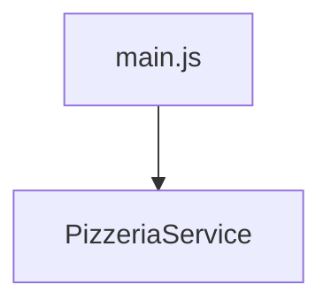
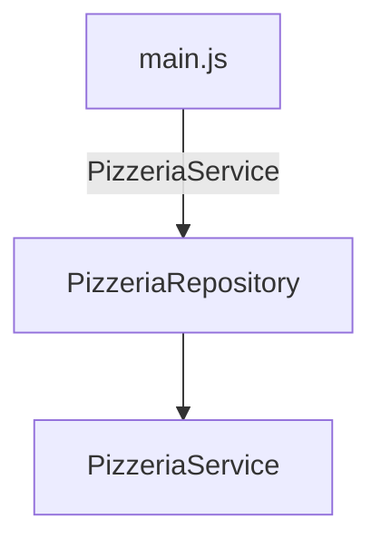
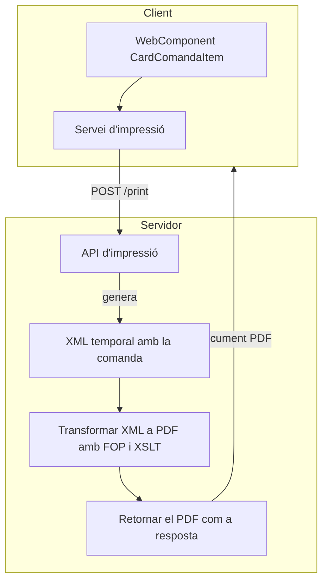
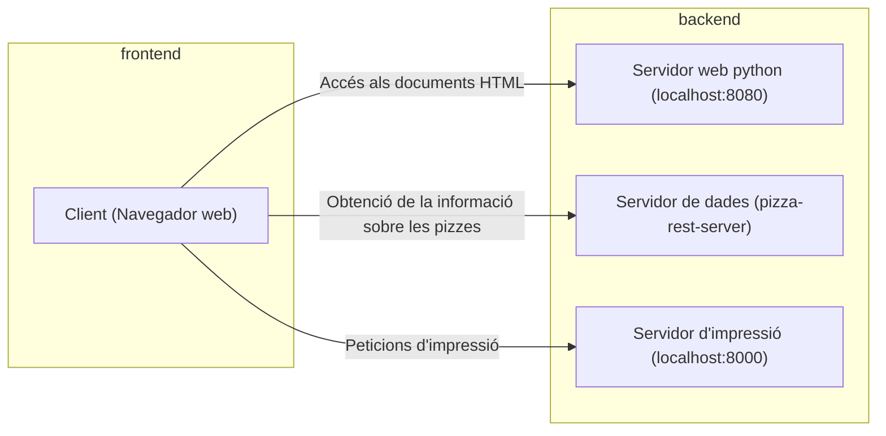

# Sprint 5. Aplicació de patrons de disseny i transformacions XSLT

## Creació d'un repositori i injecció de dependències

El primer que hem afegit en aquest Sprint ha estat l'aplicació d'un patró arquitectònic Repository. Aquest patró actua com a pont entre la lògica de negoci (coneguda com domini) i l’accés a les dades, que és el que realitzavem a la classe Service.

És a dir, passem de:



Al següent:



El codi d'aquesta nova classe Repository segueix un patró Singleton, amb les peculiaritats de Javascript (que com sabem és no tipat i no permet definir propietats privades a les classes).

```js
export class PizzeriaRepository {

    // Com que js no suporta "private", hem de definir
    // el patró singleton en el propi constructor.
    constructor(service){
        if (!this.instance) {
            this.instance = this;
            this.service=service;
      }
      return this.instance;

    }
    
    async getAllPizzes() {
        return await this.service.getAllPizzes();
    }


    async getAllEntrants() {
        return await this.service.getAllEntrants();
    }


    async getAllDrinks() {
        return await this.service.getAllDrinks();
    }

    async sendOrder(comanda) {
        return await this.service.sendOrder(comanda); 
    }
}
```

Amb això, des del fitxer principal, crearem el repositori, i li *injectarem* la dependència del PizzeriaService:

```js
// Iniciaitzem el repositori amb la classe de servei que volem
let pizzeriaRepository=new PizzeriaRepository(PizzeriaService);
```

### Què guanyem amb això?

Alguns dels avantatges d'incorporar aquesta nova capa són:

1. **Separem clarament les responsabilitats** entre la lògica de l'aplicació i l'accés a l'API (servei). D'aquesta manera, la lògica de l'aplicació demana les dades a la capa de repository, i aquesta ja les demana al servei, sent aquesta última la responsable de l'accés a les dades a través de l'API.
2. **Centralització de l'accés a les dades**: Tota la lògica d’accés a dades està en un sol lloc (la capa d'accés al servei).
3. **Es facilita el testeig**: ja que podem *moquejar* el repositori per provar les funcionalitats superiors sense necessitat d'invocar les APIs reals.
4. **Flexibilitat per canvis d’infraestructura**, amb aquesta estructura, si canviem la forma d'accedir a les dades, només hem de fer ús d'un nou servei, però la resta de l'aplicació quedaria igual.

Amb això, per exemple, si en lloc de voler obtenir la informació a través del servei que accedeix a l'API volguerem fer-ho des d'altre lloc, simplement canviariem la classe que proporcionem al repositori.


> *A tenir en compte...*
>
> Cal tindre en compte que Javascript no suporta classes abstractes ni interfícies, pel que la implementació dels patrons és menys estricta.
>
> En altres llenguatges que suporten declaració d'interfícies o classes abstractes, el repositori s'inicialitzaria amb una interfície, no amb una classe estàtica, tal i com hem fet. Així, totes les classes de tipus servei, haurien d'implementar aquesta interfície, de manera que ens assegurem que totes tinguen el mateix comportament del què fa ús el repositori.
>
> Amb això, estariem seguint millor el principi d'*inversió de dependències*, ja que les classes dependrien d'abstraccions i no d'implementacions concretes.

## Impressió de tiquets de comanda

La segona funcionalitat que hem afegit en aquest sprint és la generació d'un document pdf amb el tiquet de la comanda.

Per a això farem ús de l'eina `fop`, des del costat del servidor. El client enviarà una petició d'impressió al servidor, proporcionant-li un JSON amb la informació de la comanda, i el servidor generarà l'XML, el transformarà a XSLT-FO i generarà el pdf per a que el client el descarregue.


Client -->|POST /print| Servidor[Servidor d'impressió]
Servidor --> |Document pdf| Client

### Infraestructura

Arribats a este punt, és interessant parar-nos a veure quina infraestructura frontend/backend estem utilitzant.



Com veien, el backend es divideix en tres serveis diferents (que podriem tindre fins i tot en diferents màquines).

Fins ara haviem treballat emb el servidor web, que és qui ens serveix els els documents HTML als què accedim directament des del navegador, així com el servidor extern on es troba l'API que ens proporciona la informació sobre les pizzes.

Ara, incorporem un tercer servidor que hem anomenat Servidor d'Impressió. Aquest ara s'encarregarà de rebre peticions d'impressió, amb la informació sobre la comanda i generarà un document PDF que el client es podrà descarregar.

>
> **Per què generem el document en el servidor?**
>
> Tot i que podríem fer ús d'algunes llibreries de Javascript per generar el document pdf en el client, anem a fer ús de l'eina `fop` per aplicar transformacions amb XSL. Com que cal llançar una ordre del sistema, cosa que no podem fer des del navegador (a més que obligaria a tindre `fop` instal·lat en els clients), cal fer-ho en el servidor.
>
> Això, a més, aporta un plus de seguretat, ja que si la impressió es fa en el client, aquest està *en mans* de l'usuari, i podria modificar-ne la informació.
>
> La part del servidor d'impressió s'implementarà amb NodeJS i el framweork Express. Tot i ser tant la part del frontend com aquest backend javascript, no hem de confondre el Javascript que s'executa dins el propi navegador, el qual té accés a determinades APIs que li proporciona aquest, del Javscript utilitzat en Node, que utiliza diferents APIs.
>

Una  vegada tenim clara aquesta infraestructura, anem a veure els canvis que hem realitzat.

### Afegint un botó al webComponent CardComandaItem

El primer que hem afegit a la interfície és un botó al webComponent `CardComandaItem`.

Bàsicament, l'estructura d'aquest ara s'ha modificat per incorporar un botó:

```js
<div class="content">
    <div class="left-content">
        <h3>Comanda ${this.num}. Hora: ${this.hora}</h3>
        <p>Preu: ${this.preu} €</p>
        <div>${itemlist}</div>
    </div>
    <button class="right-button" id="print_ticket">
        Imprimir tiquet
    </button>
</div>
```

I hem afegit el següent codi per tal d'assignar-li funcionalitat:

```js
this.shadowRoot.getElementById('print_ticket').addEventListener('click', () => {
    if (this.printTicket) this.printTicket();
});
```

El mètode printTicket, bàsicament agafa la informació de la comanda, i la proporciona a un nou servei ticketService:

```js
    printTicket(){

        let productes=[];
        this.items.forEach(({ producte, quantitat }) => {
            productes.push({nom: producte.nom, quantitat: quantitat, preu: quantitat * producte.preu});
        });

        let data={
            items: productes, 
            preu: this.preu,
            hora: this.hora,
            num: this.num

        }
        TiquetService.generateTiquet(data);
        
    }
```

#### La classeTiquetService

La classe de `TiquetService`, s'ubica dins la capa d'infraestructura, en la nostre jerarquia de nivells. Aquesta classe proporcionarà un mètode estàtic `geneateTiquet`, que serà l'encarregat de generar el tiquet amb les dades proporcionades.

```js
export class TiquetService {
    static async generateTiquet(tiquetData) {
        ...
    }
}
```

Dins aquest mètode, farem una petició de tipus POST al servidor d'impressió, ubicat a la URL `http://127.0.0.1:8000/print`. Al [*Readme.md* de la carpeta Sprint5_](./../Sprint5_Backend/readme.md) trobareu com s'ha implementat aquest.

```js
const response = await fetch('http://127.0.0.1:8000/print', {
    method: 'POST',
    headers: {
        'Content-Type': 'application/json'
        },
    body: JSON.stringify({ data: tiquetData })
});
```

Com veiem, enviem un String amb el contingut JSON del tiquet.

Després de comprovar els errors, otenim la resposta (recordeur que `response` és una `Promise`, pel que necessitem un `await`), com a un tipus [Blob](https://developer.mozilla.org/es/docs/Web/API/Blob), que bàsicament ens serveix per epresentar fitxers de dades:

```js
const blob = await response.blob();
```

I ara, amb el següent codi, fem el següent:

1. Creem un objecte de tipus URL amb aquest *blob*, per tal de poder accedir a ell
2. Creem un enllaç (etiquta `<a>`), que faça referència a aquesta URL.
3. Canviem el nom del fitxer generat per `tiquet.pdf`
4. Afegim l'enllaç al document i forcem la seua descàrrega.
5. Eliminem l'enllaç i esborrem la URL generada.

```js
const url = URL.createObjectURL(blob);

// Creem un enllaç i el descarreguem
const a = document.createElement('a');
a.href = url;
a.download = "tiquet.pdf"; 
document.body.appendChild(a);
a.click();
a.remove();
URL.revokeObjectURL(url);
```